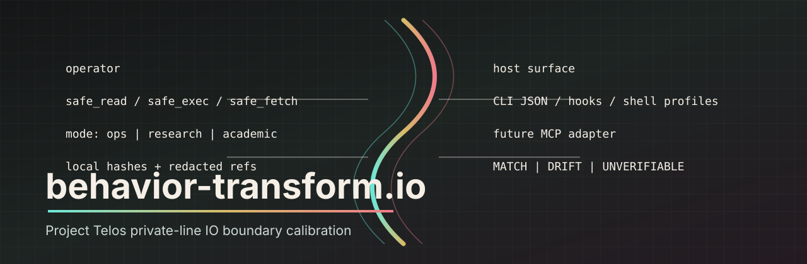

# behavior-transform.io



`behavior-transform.io` is the Project Telos private-line IO boundary
calibration layer. It provides local wrappers, hooks, and shell profiles for
read, write, exec, fetch, input, and model-boundary channels.

Its job is practical: make workstation IO explicit, mode-aware, and receipt
friendly without requiring hosts to ingest raw prompts, private file contents,
secret values, or full model-boundary payloads.

```bash
python tools/behavior_flagship.py status --json
python tools/behavior_flagship.py doctor --json
python tools/behavior_flagship.py demo --json
```

## Flagship Contract

| Surface | Status |
|---------|--------|
| CLI JSON | `tools/behavior_flagship.py status|doctor|demo --json` |
| Runtime profiles | `ops`, `research`, `academic` |
| Hook surface | Claude Code PreToolUse/PostToolUse hooks in `hooks/` |
| Shell surface | PowerShell, CMD, and sh profile helpers in `profiles/` |
| Interop schemas | `project-telos.flagship-action/v1`, `project-telos.action-receipt/v1`, `project-telos.context-envelope/v1` |
| Privacy boundary | Host receives counts, hashes, verdicts, and redacted refs; local adapters retain raw content |

## Modes

| Mode | Profile | Behavior |
|------|---------|----------|
| `ops` | standard | Calibration stack active |
| `research` | native | Source-faithful passthrough |
| `academic` | native | Research alias |

Switch mode:

```bash
python tools/io_state.py --set research
python tools/io_state.py --set ops
```

## Structure

```text
tools/      Core modules and CLI wrappers
hooks/      Claude Code hook adapters
profiles/   Shell integration helpers
tests/      Pytest and unittest coverage
docs/       Specs, plans, and integration contracts
```

## Verification

```bash
python -m pytest -q
python tools/behavior_flagship.py doctor --json
```

See [docs/INTEGRATION_CONTRACT.md](docs/INTEGRATION_CONTRACT.md) for the IO
boundary contract.
