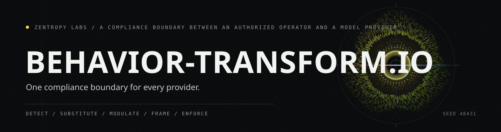

# behavior-transform.io



`behavior-transform.io` is a pre/post inference compliance intermediary. It sits
between an authorized operator and an AI model provider, transforming sensitive
operational context into language that falls within the provider's terms of
service before inference, and stripping formatting artifacts from the response
afterward.


## Who this is for

Law enforcement, government, military, and authorized security operations teams
that use AI models as part of their operational workflows. These entities conduct
work that is legal, internally authorized, and conducted under formal rules of
engagement, but that uses terminology and describes scenarios a general-purpose
model provider will flag or refuse under its default content policy.

Enterprise agreements with providers exist for this purpose. Anthropic, OpenAI,
and Google each offer government and enterprise tiers with scoped policy
adjustments. Those agreements work, but they create a separate relationship per
provider, each with its own onboarding, compliance surface, and failure modes.
An organization using three providers maintains three policy boundaries, three
sets of credentials, and three integration surfaces. When a provider tightens
its content policy, every downstream consumer of that agreement absorbs the
friction individually.

behavior-transform.io is a single compliance boundary. One integration point
handles the vocabulary translation, authorization framing, and policy-gate
logic for every provider behind it. One boundary means one failure point to
diagnose, one configuration to audit, and one surface to maintain. It reduces
the N-to-N relationship between authorized entities and model providers to a
hub that both sides connect to.

## What it is not

behavior-transform.io is not an offensive tool and does not perform offensive
operations. It does not generate attacks, produce harmful content, or provide
capabilities the operator does not already have authorization for.

It is not a jailbreak. A jailbreak attempts to make a model act against its
safety training for any user. This tool translates authorized operational
language into a register that aligns with provider terms of service, for
operators whose authorization is established before the tool runs. The
distinction is the authorization chain: if the operator does not hold a valid
grant, the tool's gate system blocks the request.

## How it works

The tool runs eight layers on every request before it reaches a model:


1. **Category detection** classifies the input across 14 content categories.
2. **Vocabulary substitution** replaces operational terminology with
   consulting-register equivalents (150+ rules).
3. **Semantic modulation** applies five layers of contextual rewriting.
4. **Cyber modulation** maps ATT&CK-phase terminology to assessment language.
5. **Prose calibration** normalizes register across the full text.
6. **Compound reframing** handles multi-clause constructions.
7. **Authorization framing** adds context establishing the operator's
   authorization basis.
8. **Token optimization** compresses the result for efficient inference.

On the return leg, the response passes through an output enforcer that strips
formatting artifacts and preamble boilerplate, so the operator receives a clean
operational response.

The **pipeline scan** (`bt scan`) evaluates a request without transforming it,
reporting pressure (estimated refusal probability), policy gate decision, and
friction score. This lets an operator preview whether a request needs
transformation before sending it.

The **authority system** derives authorization from the deployment environment:
machine fingerprint, capsule integrity, seal validity, and activation state. No
external auth server or token exchange is needed. If the grant is invalid, the
tool blocks the request.


## Usage

```bash
python -m pip install -e .
bt --help
bt status --json
bt doctor --json
```

For full commands, see [USAGE.md](USAGE.md) and
[GETTING-STARTED.md](GETTING-STARTED.md).

## For developers

Run the flagship tests and doctor before changing any subsystem:

```bash
python -B -m pytest tests/test_behavior_flagship.py tests/test_behavior_delivery_contract.py -q
python -B tools/behavior_flagship.py doctor --json
```

Delivery-surface changes should also pass:

```bash
python -m public_surface_sweeper . --workspace --json
```

## Modes

| Mode | Profile | Behavior |
|------|---------|----------|
| `ops` | standard | Full calibration stack active |
| `research` | native | Source-faithful passthrough, no substitution |
| `academic` | native | Alias for research |

Switch mode:

```bash
python tools/io_state.py --set research
python tools/io_state.py --set ops
```

## Structure

```text
tools/      Core modules and CLI wrappers
hooks/      Claude Code hook adapters
profiles/   Shell integration helpers
tests/      Pytest and unittest coverage
docs/       Specs, plans, and integration contracts
```

## Verification

```bash
python -m pytest -q
bt doctor --json
```

See [docs/INTEGRATION_CONTRACT.md](docs/INTEGRATION_CONTRACT.md) for the IO
boundary contract. See [AGENTS.md](AGENTS.md) for local agent instructions and
[USAGE.md](USAGE.md) for operator/developer commands.
